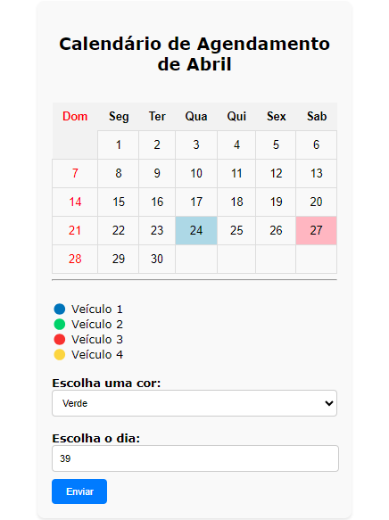

# ÍNDICE

* [Descrição](#descrição)
* [Introdução](#introdução)
* [Funcionalidades](#funcionalidades)
* [Calendário](#calendário)
* [Tecnologias Utilizadas](#tecnologias-utilizadas)
* [Referências](#referências)
* [Autores](#autores)

# Calendário de Agendamento de Fretes

## Descrição 📒
O Calendário de Agendamento de Fretes é uma aplicação web desenvolvida para facilitar o agendamento de fretes da empresa Alpha. A aplicação permite aos colaboradores da área de agendamento registrar os agendamentos de fretes de forma visual e organizada, seguindo as regras estabelecidas pela empresa.

## Introdução 📖
A empresa Alpha é uma empresa de fretamento que necessita de uma solução eficiente para o agendamento de fretes dos veículos. A vaga de estagiário na área de agendamento demanda a criação de uma ferramenta que permita o registro dos agendamentos de forma fácil e intuitiva. Este projeto visa atender a essa demanda, fornecendo uma solução prática e funcional para o agendamento de fretes.

## Calendário 🗓️

## Funcionalidades ⚙️
- Marcação de dias no calendário, atribuindo a eles a cor do veículo que realizará o frete.
- Identificação visual dos veículos através das cores:
- Azul para o veículo 1
- Verde para o veículo 2
- Rosa para o veículo 3
- Roxo para o veículo 4
- Restrições de agendamento:
- Um veículo não pode realizar mais de um frete no mesmo dia.
- Cada veículo pode realizar no máximo 3 fretes por mês.

## Tecnologias Utilizadas 💻
- HTML5
- CSS3
- JavaScript

## Referências 📝
- https://github.com/opensource-coding/Responsive-Calendar-with-Events

## Autor 👤
- João Pedro Gonçalves